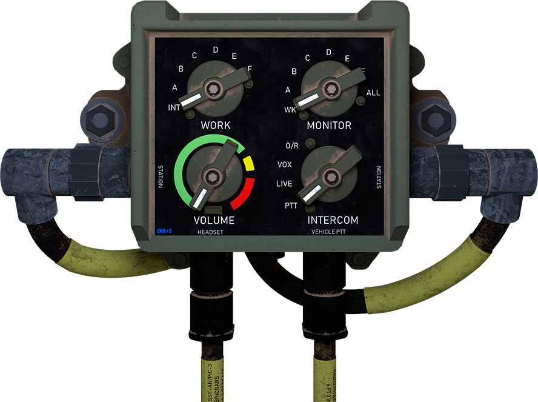

# Sistema d'intercom i telèfon d'infanteria

## Intercom

Aquest sistema et dona l'habilitat de parlar als companys que es troben dins el vehicle directament a través dels auriculars, especialment útil per evitar les distorsions provocades pels sorolls del vehicle. Depenent el tipus de vehicle podem trobar dues malles:

- **Crew**: malla únicament disponible per a posicions de tripulació.
- **Pax**: malla disponible per a posicions de tripulació i passatgers.

Per canviar de malla cal utilitzar interacció externa d'ACE3 mentres s'està dins del vehicle (sempre que n'hi hagi més d'una disponible). Cal recordar que no tots els vehicles o posicions dins els vehicles disposen de sistemes d'intercom.

Per a parlar pel sistema d'intercom no cal fer res més que parlar de manera habitual com es fa fora del vehicle.

Les estacions del sistema intercom disposen de tres configuracions:

- **Rebre**: el tripulant només podrà escoltar les comunicacions de la malla d'intercom però no emetre. Es simbolitza amb la lletra (R) al HUD superior esquerra.

- **Emetre**: el tripulant només podrà emetre comunicacions de la malla d'intercom però no rebre respostes. Es simbolitza amb la lletra (T) al HUD superior esquerra.

- **Rebre i emetre**: el tripulant pot emetre i rebre comunicacions de manera simultània. Es simbolitza amb (R/T) al HUD superior esquerra.

Adicionalment disposem de dos modes d'operació a través de la interacció.

- **Voice activation**: el tripulant emetrà automàticament per l'intercom quan comenci a parlar. En aquest cas la lletra T del HUD es substitueix per una P.

- **PTT activation**: el tripulant només transmetrà quan premi la tecla de PTT d'intercom (per defecte no ve configurada). En aquest cas la lletra T del HUD es substitueix per una B.

### Estació individual Full Functional Crew Station (FFCS)

{: .center}

La interfície FFCS ens permet realitzar diferents funcions sobre l'intercom. S'activa amb les tecles Shift+Ctrl+Tab.

- **Volume**: canvia el volum general de la intercom i de les radios monitoritzades o actives. La franja vermella augmenta considerablement el so especialment per entorns molt sorollosos.

- **Monitor**: permet monitoritzar una o totes les radios connectades als racks del vehicle. Amb aquest mode només es permet rebre comunicacions.

- **Work**: permet seleccionar una radio de rack per a rebre i emetre.

- **Intercom**:
  - *PTT*: selecciona el mode d'activació PTT a l'intercom.
  - *LIVE/VOX*: equivalen a seleccionar el mode d'activació per veu.
  - *O/R*: permet al FFCS emetre un missatge amb alta prioritat, silenciant la resta d'estacions.

## Telèfon d'infanteria

En alguns vehicles, com IFVs o tancs, es disposa d'un sistema de comunicació extern mitjançant un telèfon que va enganxat a la part exterior del vehicle, per permetre que la infanteria es pugui comunicar amb la tripulació de l'interior del vehicle.

Per a fer-lo servir, simplement has d'interactuar amb el vehicle i sel·leccionar la malla interna de l'intercom en la que et vulguis comunicar. Adicionalment pots passar el telèfon a un altre company, deixar-lo o canviar la malla. La distància màxima a la que pot funcionar el telèfon es de 10m.

La tripulació del vehicle pot controlar el to d'avís del telèfon d'infanteria des de l'interior a través de la interacció.
