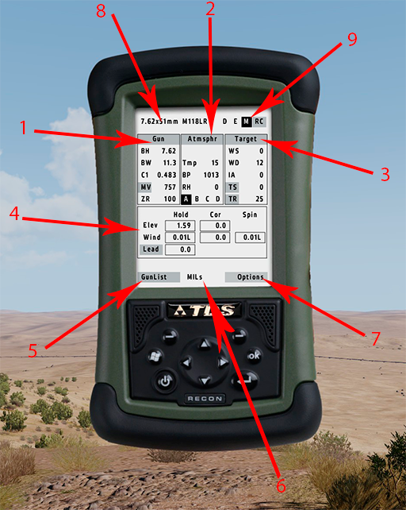
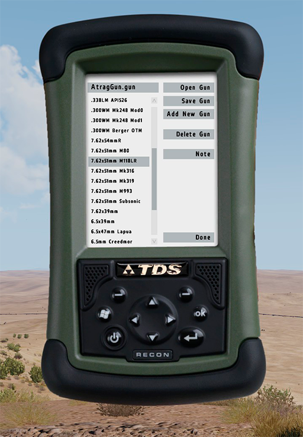
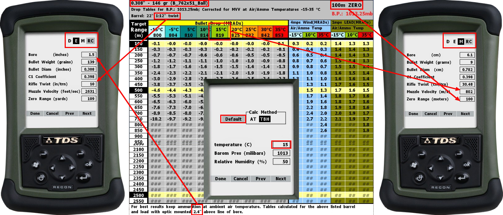
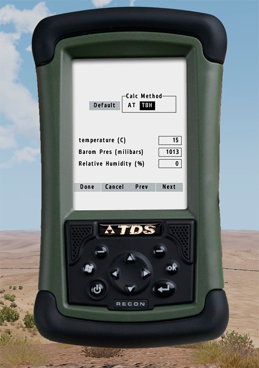
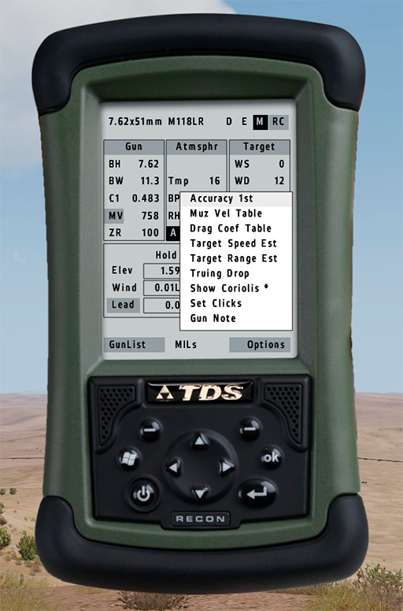
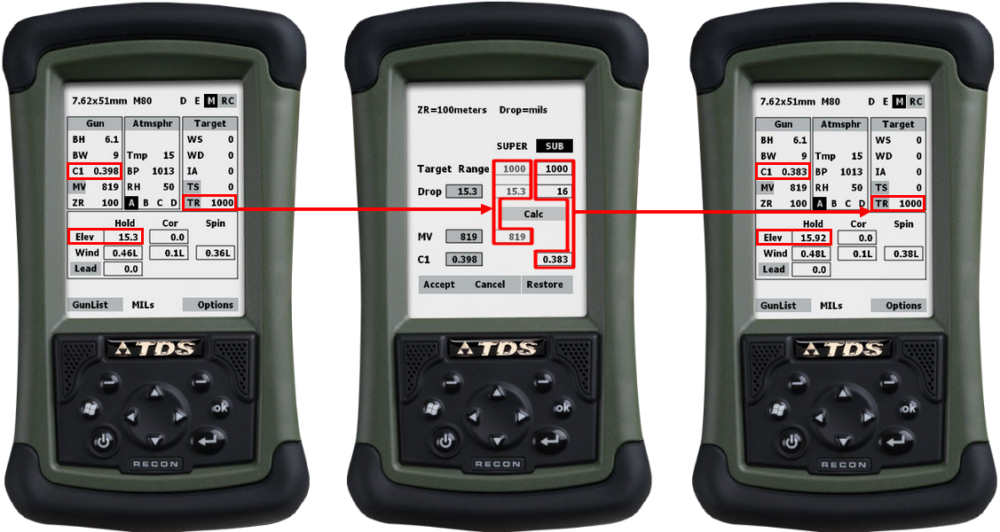
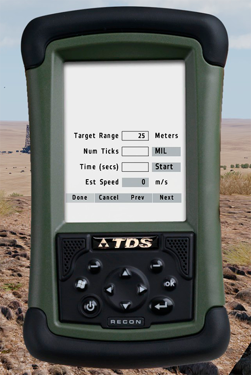
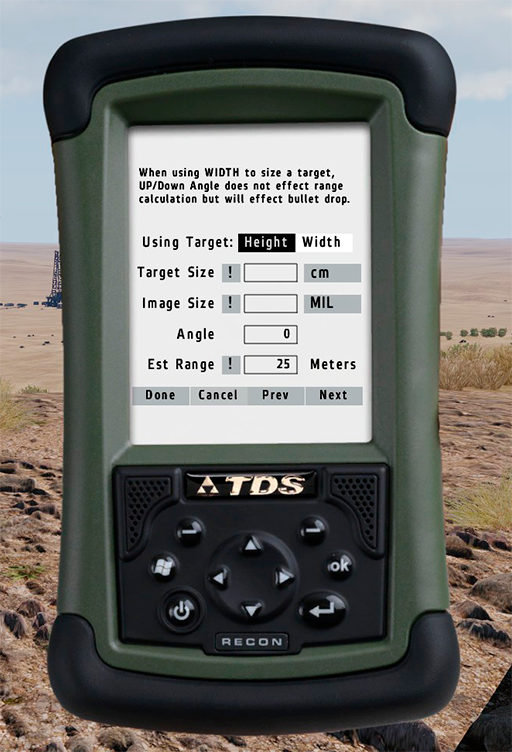
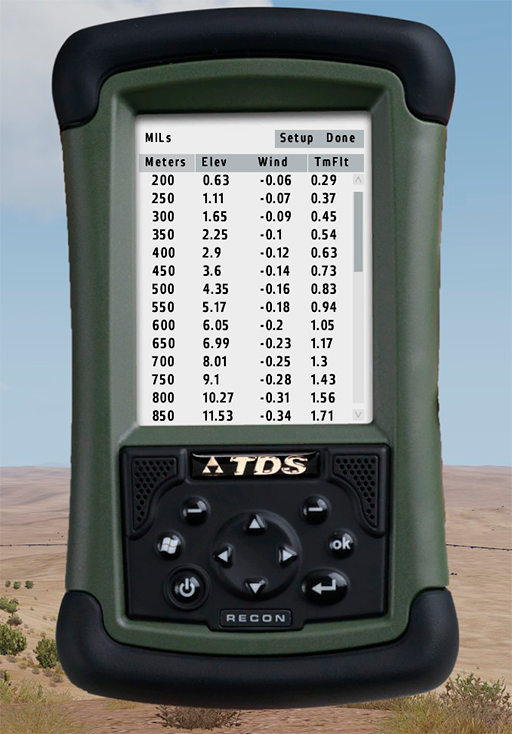

# Calculadora balística Horus ATragMX

## Vista ràpida

La Horus ATragMX es una calculadora balística de butxaca que permet calcular amb total precisió els valors d'elevació, wind drift, coriolis drift, spin drift i lead drift amb els quals calibrarem la mira telescòpica per efectuar trets d'alta precisió.

Es tracta de l'eina més potent que tenim al nostre abast i la quantitat de funcionalitats que te la fan molt complexa d'utilitzar. En aquest curs, tot i que veurem totes les seves funcionalitats en detall, només ens interessa que s'aprengui a fer servir amb el mètode bàsic i ràpid que veurem en el següent capítol.

La calculadora la trobarem a qualsevol arsenal, tingueu en compte que al ser un aparell relativament modern es probable que depenent l'any en que s'ha ambientat la missió no la tinguem disponible. Un cop la tinguem equipada farem servir el menú d'interacció pròpia de l'ACE 3 en el subapartat d'equipament, per a poder manipular-la.

{: .center}

A la pantalla principal trobarem diferents opcions (els botons estan resaltats en gris):

1. **Gun:** Ens permet introduïr els paràmetres de l'arma i munició que farem servir.
2. **Atmsphr:** Ens permet introduïr els paràmetres atmosfèrics (densitat de l'aire).
3. **Target:** Ens permet introduir la informació de l'objectiu (distancia, azimut, angle, etc).
4. **Dades balístiques:** Ens indica el resultat del càlcul per a l'elevació, desviació per vent i, si un cas, desviació per desplaçament (lead), en la unitat que haguem escollit (principalment mils), també ens mostra la correcció desglossada per a Coriolis i per al Spin Drift.
5. **GunList:** Ens permet escollir el tipus de munició o introduïr-ne una de nova.
6. **MILs:** Ens permet canviar entre les diferents unitats base, MILs, MOAs, clicks, etc.
7. **Options:** Ens permet modificar algunes opcions de la calculadora i accedir a eines avançades.
8. Tipus de munició que tenim seleccionat.
9. Sistema d'unitats, normalment farem servir M (sistema mètric), D i E son diferents versions del sistema imperial i es faran servir per a ajustar les dades balístiques de la taula de rangs, que generalment venen donades en aquest sistema. RC es una petita taula de rangs auto-calculada.

## Funcionament

### GunList

Normalment abans de sortir de base el que se sol fer es preparar tot allò que sabem segur que no haurem de canviar a la calculadora, ja que ens farà guanyar temps a l'hora d'interactuar amb ella posteriorment. Una de les coses que hem de deixar preparades son les dades sobre la munició i sobre l'arma.

A l'apartat GunList tenim tot un llistat de municions. Per saber quina hem de seleccionar, es important fer memòria i tenir en compte que el tipus de munició surt reflectida a la capçalera de la taula de rangs.

{: .center}

Per a carregar les dades balístiques del tipus de munició, es suficient seleccionant-la a la llista i seguidament fent clic a **Open Gun**.

### Gun

Un cop haguem carregat les dades balístiques de la munició, ens caldrà revisar que son correctes per al tipus específic de munició o fusell que fem servir. Per a això tenim l'apartat Gun on ja veurem una serie de dades que s'han pre-carregat. Si fem clic al botó veurem la següent pantalla:

{: .center}

Aquest pas no sol ser essencial però ens ajudarà a asegurar-nos que les dades que hi ha introduïdes son 100% vàlides per a la nostra munició, ja que podria ser que per algun motiu fosin incorrectes.

Per a corregir-les, primerament canviarem el sistema d'unitats a Imperial (E) i modificarem el valor Bore en polzades segons el que surt a la taula de rangs i el Rifle Twist també en polzades (inches).

Un cop fet això, canviarem novament al sistema mètric i comprovarem que el valor ZERO de la taula de rangs coincideix amb el de la calculadora i que la velocitat inicial (Muzzle Velocity) coincideix també amb la que introduirem a l'apartat de dades atmosfèriques segons la taula de rangs.

{: .center}

Un cop acabem fem clic a **Done**.

#### Afegir una nova arma i estimar el coeficient balístic C1 manualment

En cas de que no disposem de les dades balístiques ja predeterminades a la calculadora, podriem crear una nova configuració.
 
Aquesta part es força avançada i rarament es donarà el cas en que ho haguem de fer, tanmateix expliquem el procediment a grans trets per a que tingueu aquesta informació a ma.

1. Anem a **GunList**.
2. Carreguem les dades balístiques del calibre que més s'acosti més al que volem configurar o d'un de semblant.
3. Fem clic a **Add New Gun** i li donem un nom a la configuració.
4. Seleccionem i carreguem la nova configuració des de la llista (haurà copiat les dades del calibre que hem carregat anteriorment).
5. Canviem el sistema d'unitats a imperial (E) i introduïm els valors de Bore, pes de la bala en grains (gr), diàmetre de la bala en polzades i Rifle Twist de la taula de rangs (veure la imatge de més amunt).
6. Canviem el sistema d'unitats a mètric i anem a la pantalla principal. Fem clic al botó **MV** dins l'apartat de **Gun**.
7. Introduïm els diferents valors de Muzzle Velocity corresponent a les diferents temperatures (també des de la taula de rangs).
8. Ens asegurem que el valor Zero Range es 100m al estar en el sistema mètric.
9. Emplenarem la resta d'apartats **Atmsphr** i **Target** com si anessim a disparar a un suposat blanc, les dades han de ser correctes i reals, no inventades, sino no funcionarà.
10. Anem a la taula de rangs i prenem com a mínim 4 distàncies i anotem en un paper la distància i la correcció de caiguda corresponent que surt a la taula (Bullet Drop).
11. Per a cada distància que haguem anotat, hem de modificar-la a l'apartat **Target** i recalcular, en aquest moment comparem el valor de correcció que ens dona la calculadora, amb el que hem apuntat de la taula de rangs. Si no es exactament igual, hem de modificar el coeficient C1 de l'apartat **Gun** ja sigui augmentant-lo o disminuint-lo.
12. Hem de fer successives modificacions del coeficient C1 fins que veiem que el resultat que ens dona es correcte. Aquest procés l'hem de repetir per a cada distància.
13. Hem d'anotar tots els valors finals de coeficient C1 per a cada distancia.
14. Finalment anem a **Options** i a **Drag Coef Table**. Hem d'omplir la taula amb les diferents distàncies i el corresponent coeficient C1 que hem calculat i finalment fem clic a Done.
15. Per a desar la configuració, anem a **GunList**, seleccionem la nostra configuració a la llista i fem clic a **Save Gun**. 

### Atmsphr

Aquest apartat ens permetrà definir les dades atmosfèriques bàsiques. Com que solen ser dades que varien molt segons on ens trobem, les introduïrem un cop ens trobem a la posició de tir i no abans. L'haurem d'anar modificant cada vegada que hi hagi un canvi de posició o un canvi notable en alguna de les variables. Totes les dades d'aquest apartat es poden extreure del Kestrel 4500.

{: .center}

Veurem que hi ha dos modes de càlcul un es amb altitud i temperatura (AT) i l'altre es amb les tres variables que defineixen la densitat de l'aire (TBH). Per defecte nosaltres utilitzarem sempre que puguem el segon, degut a que es molt més precís.

Bàsicament ens demana introduïr la temperatura en graus centígrads, la pressió baromètrica en milibars (recordeu que un hPA equival a un milibar) i la humitat relativa en %.

Un cop introduit fem clic a **Done**.

### Target

Es l'últim dels tres apartats de dades i el més important, en aquest es on introduirem les dades de l'objectiu i sempre serà el pas previ a obtenir els resultats dels càlculs. Al ser dades que depenen de cada objectiu, no les podrem introduir amb anterioritat com es obvi i canviaràn per a cada objectiu, tanmateix hi ha alguns mètodes per escurçar el temps que es triga en omplir les dades tal com veurem més endavant.

{: .center}

1. **Latitud:** Es la latitud del mapa on ens trobem i serveix per a calcular les correccions de Coriolis i Eötvös. Per a obtenir la latitud que correspon, podeu consultar el següent enllaç: https://github.com/acemod/ACE3/blob/master/addons/common/functions/fnc_getMapData.sqf

2. **Dir of Fire:** Azimut a l'objectiu en graus magnètics.

3. **Wind Speed:** Velocitat del vent en metres per segon, cal introduïr dos valors entre els quals es poden moure els càlculs ja que la velocitat sol fluctuar bastant, l'ideal es introduir el valor de velocitat del vent on ens trobem nosaltres al primer camp i despres el valor de velocitat mitjà (average) al segon, que haurem calculat previament amb ajuda del Kestrel 4500.

4. **Wind Direction:** Direcció del vent en format d'agulles del rellotge. Recorda que es la direcció relativa mentres apuntes a l'objectiu.

5. **Inclination Angle:** Angle d'inclinació de l'arma respecte de l'objectiu. El podem calcular amb ajuda del transportador d'angles del fusell o bé amb ajuda del Vector 21. També es interessant introduïr dos valors mínim i màxim ja que l'angle també sol variar força i més si l'objectiu està en moviment.

6. **Target Speed:** Ens permet indicar la velocitat aproximada de l'objectiu en metres per segon i si el desplaçament es cap a la dreta o l'esquerra mitjançant el botó del xebró ">" o "<". Aquesta dada afecta a la correcció horitzontal.

7. **Target Range:** Finalment se'ns demana d'introduir la distància a l'objectiu en metres.

Un cop ho tinguem tot introduir podem fer clic a **Done**.

### Options

A la pàgina principal de la calculadora tenim un botó d'opcions, aquest botó ens dona accés a diferents eines i opcions complementaries amb les quals podem ajustar diferents paràmetres.

{: .center}

1. **Accuracy 1st:** Sense utilitat.
2. **Muz Vel Table:** Taula de velocitats inicials (muzzle velocity). L'hem vist en apartats anteriors. Conté la relació de velocitats inicials amb la corresponent temperatura del preset que tinguem carregat.
3. **Drag Coef Table:** Taula de coeficients balístics C1. També l'hem vista en apartats anteriors. Conté la relació de coeficients balístics C1 amb les corresponents distàncies.
4. **Target Speed Est:** Ens permet obtenir la velocitat aproximada d'un blanc per deriva (Lead).
5. **Target Range Est:** Ens permet estimar la distancia aproximada del blanc fent servir el mètode dels mils (vegeu l'apartat de la mira Mildot). No es recomana d'utilitzar tret que no disposem de telèmetre.
6. **Truing Drop:** Ens permet utilitzar la Truing Tool (info més endavant).
7. **Show Coriolis:** Ens permet ocultar/mostrar els resultats dels càlculs de Coriolis i Spin Drift.
8. **Set Clicks:** Ens permet canviar la unitat base en la qual volem que ens mostri les diferents correccions. Tenim disponible MILs, MOAs i clicks, els clicks ens permeten assignar un valor de mils a cada click de manera que les correccions només les haguem de transmetre al franctirador en clicks (literalment cada 'clic' que es fa al girar els dials de la mira).
9. **Gun Note:** Ens permet fer anotacions respecte a l'actual preset de configuració.

### Truing Tool

Aquesta eina ens permet recalcular el coeficient balístics automàticament adequant-se perfectament a qualsevol distància. Es una opció que no es imprescindible utilitzar, però que ens pot servir per acabar d'afinar alguns trets considerats vitals ja que apart de validar que el coeficient es el que toca, també ens el corregeix automàticament en cas que no ho sigui.

Per a configurar la Truing Tool seguirem els següents passos:

1. Anem a Options i seguidament Truing Drop.
2. Afegim la distancia real a l'objectiu actual dins la pestanya SUPER i fem clic a Calc.
3. Afegim la mateixa distància dins la pestanya SUB i fem clic a Calc.
4. Afegim la correcció d'elevació actual a l'apartat Drop i fem clic a Calc.
5. Fem clic a Acceptar.
6. Veurem que s'han actualitzar els valors C1 i la correcció per elevació.
7. A partir d'ara cada vegada que ajustem la distància a l'objectiu dins l'apartat Target, el coeficient es recalcularà automàticament. També es recalcula automàticament la taula Drag Coeficient.

{: .center}

### Target Speed Estimation

Per estimar la velocitat de deriva (Lead) a la que es mou un blanc, podem utilitzar aquesta utilitat que es troba al menú d'opcions o al botó TS de l'apartat Target de la calculadora. El mètode es molt senzill i consta dels següents passos:

1. **Target Range:** Introduim la distància a l'objectiu aproximada (es recomanable augmentar o disminuir aquest valor segons veiem que l'objectiu s'apropa o s'allunya).
2. **Num Ticks:** Afegir el nombre de mils de la reticula de la nostra mira en horitzontal (normalment son 5).
3. Coloquem el centre de la mira sobre l'objectiu al mateix temps que premem el botó **Start**. Hem de deixar la mira estàtica i quan veiem que l'objectiu ha superat el 5è tick ja sigui per la dreta o per l'esquerra (punt de mils) cliquem **Stop**.
4. I ja tindrem la velocitat aproximada a la que es mou.

{: .center}

### Target Range Estimation

També podem estimar la distància a l'objectiu en cas de no disposar de telèmetre per fer-ho de manera més precissa. Aquesta situació rarament es dona en combat ja que si duem una calculadora balística, el més normal es que també duguem un telèmetre o designador làser. Tanmateix en alguns casos extrems i en que no disposem de tal eina, ens pot salvar.

Tenim dos mètodes de càlcul, el primer funciona respecte l'altura del blanc (Height) i l'altre per l'amplada (Width), agafem el que més ens convingui segons les dimensions del blanc.

1. **Target Size:** hem d'introduir l'alçada o l'amplada aproximada del blanc, això es a ull però per a infanteria l'alçada habitual sol ser de 180 cm.
2. **Image Size:** introduim l'alçada o l'amplada relativa del blanc en mils (la podem mesurar amb la retícula mildot).
3. **Angle:** introduim l'angle d'inclinació aproximat, l'hem d'extreure del transportador de l'arma ja que no disposarem de telèmetre per calcular-lo.
4. Fem clic al simbol "!" de **Est Range** i ens calcularà la distància aproximada. Finalment a **Done** i aquesta quedara gravada a l'apartat corresponent.

{: .center}

### Range Card (auto-calculada)

Es tracta d'una petita taula de rangs autocalculada segons les dades balístiques del preset que tinguem carregat a la calculadora. Ens pot servir de referència ràpida en alguns casos en els quals haguem de fer foc ràpid. 

Si fem clic al botó Setup ens permetrà introduïr el rang mínim-màxim en metres i la diferència entre cada valor de l'escala. Cal tenir en compte que la taula es recalcula cada vegada que canviem algun paràmetre.

{: .center}
