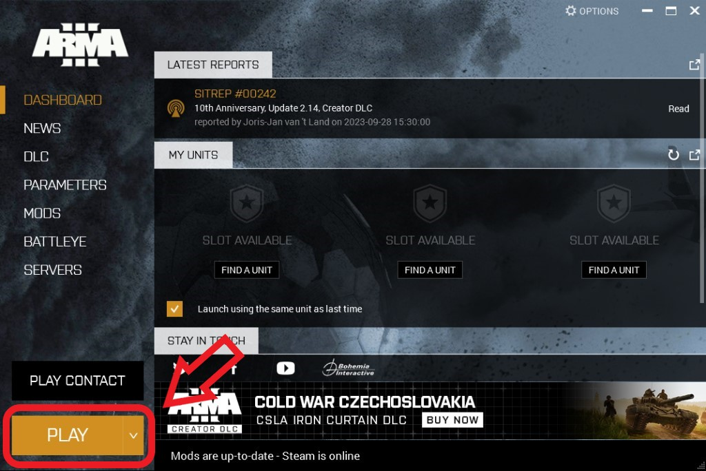
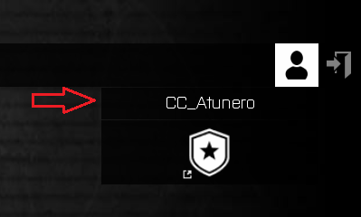
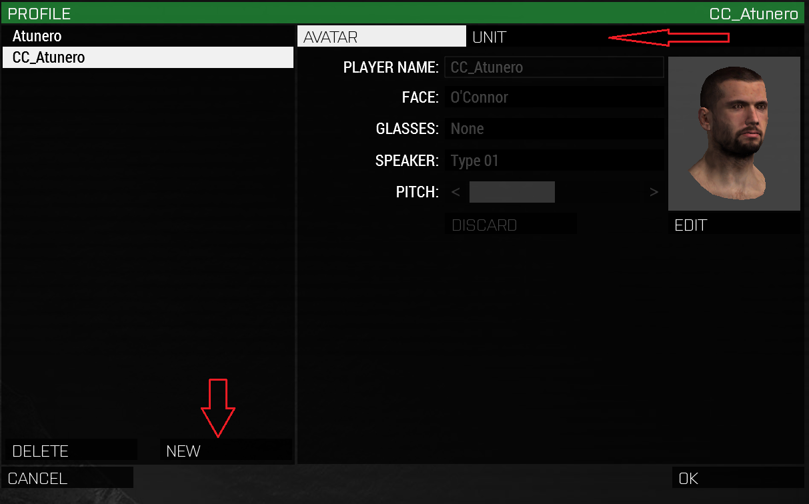
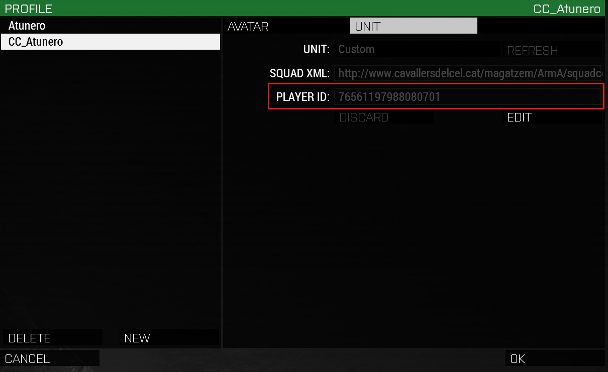

# Pas 3: Configuració perfil

Assegura't de no tenir cap mod ni DLC marcat.

Fes clic al botó `Play` per arrancar Arma 3.

{: .center}

Dins el menú principal del simulador, ves al botó de perfil que hi ha a dalt a la
dreta (és la icona d’un cap).

{: .center}

Selecciona el teu perfil i s'obrirà una finestra com la següent.

{: .center}

Al perfil per defecte no pots canviar-li el nom, així que hauràs de crear un de nou i posar-li el `CC_` davant, com en la imatge anterior.

!!! danger "Important"

	No li posis ni ulleres ni maquillatge, això ho podràs fer a cada missió.

Un cop fet això, clica sobre `Unit` i s'obrirà la pantalla següent.

{: .center}

Has de copiar el número que hi ha destacat en vermell. Després has d'anar [aquí](http://cavallersdelcel.cat/forums/threads/id-jugador-url-squad-de-larma-3.425/) i deixar un missatge amb aquest.

Seguidament has d'introduïr la següent URL al camp `SQUAD XML`:

http://www.cavallersdelcel.cat/magatzem/ArmA/squadcc/cc_elteunick.xml

Substituïnt "elteunick" pel sobrenom que has triat en minúscules tal i com s'explica a l'enllaç del forum.

!!! danger "Important"

	Si tens problemes per registrar-te al fòrum, pots passar-li el número al teu instructor i ell s'encarregarà de la resta.

[Següent pas >](http://arma.cavallersdelcel.cat/gn/pas4)
